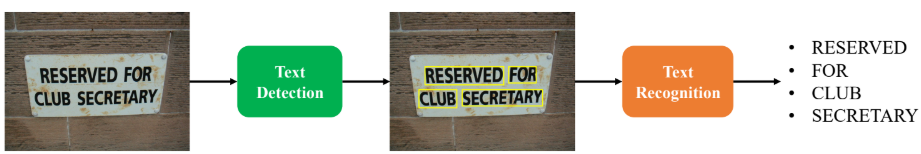
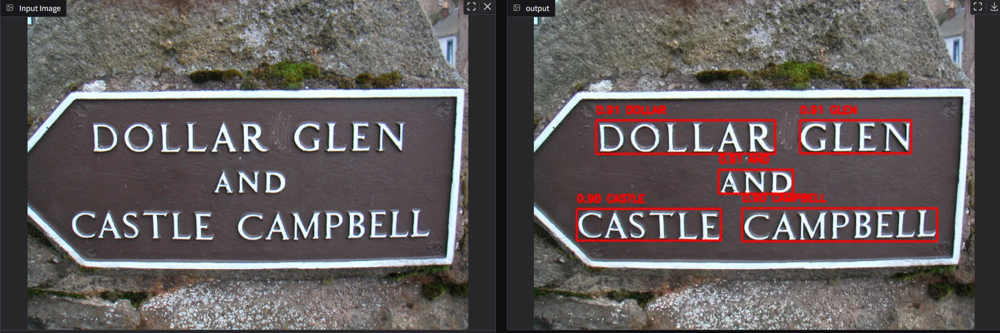
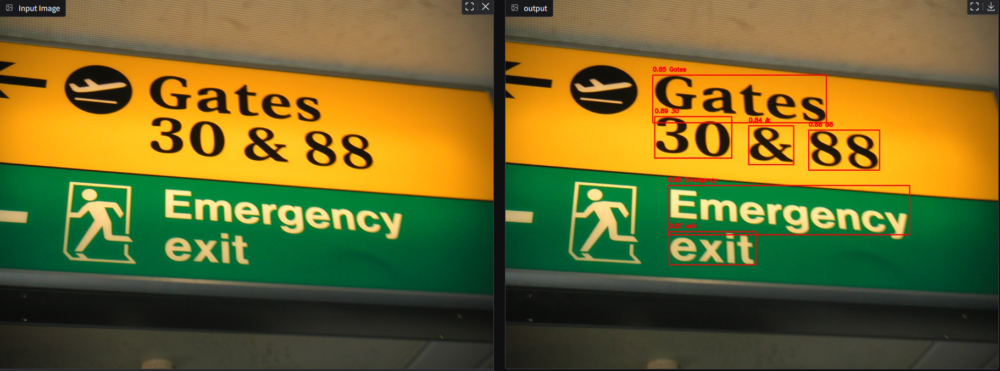
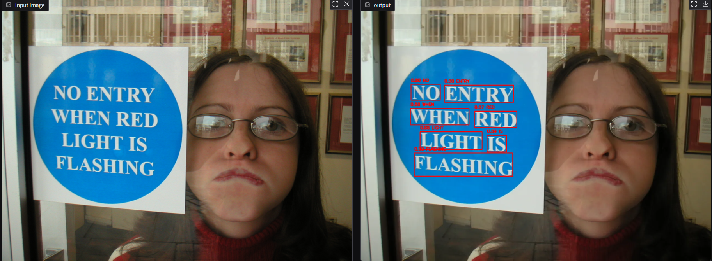
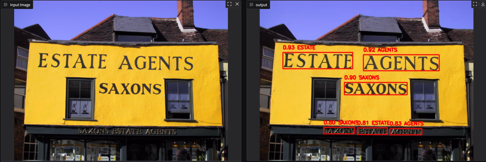
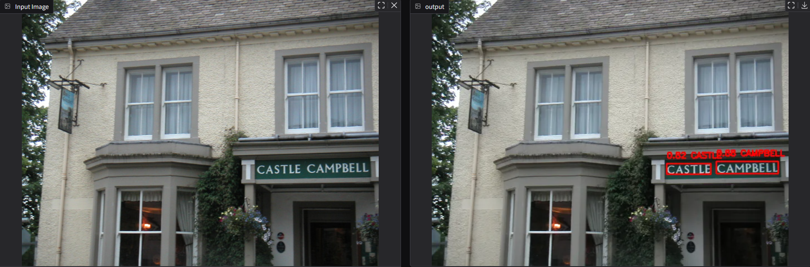
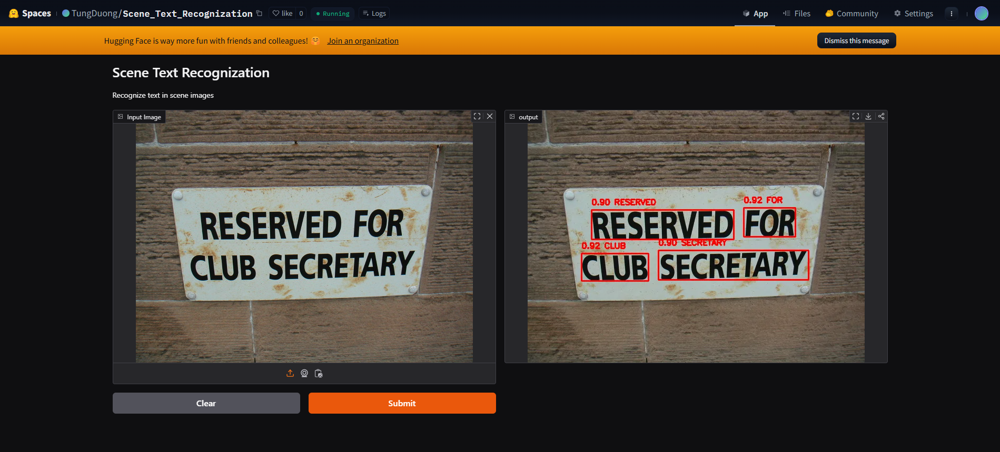
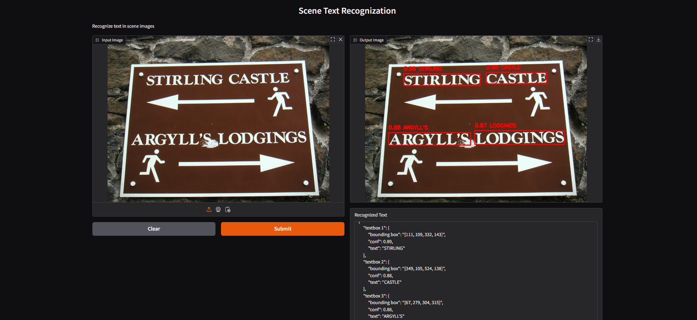

# Scene Text Recognition

## Overview

**Scene Text Recognition** is a robust two-stage pipeline designed for detecting and reading text from scene images. The system first leverages the `yolov11` model to accurately detect text regions and subsequently applies the `CRNN` model to recognize the text. This approach effectively addresses challenges posed by diverse fonts, complex backgrounds, and various text orientations.

**Download the dataset** [here](https://drive.google.com/file/d/1kUy2tuH-kKBlFCNA0a9sqD2TG4uyvBnV/view).

## Pipeline
The overall processing pipeline is illustrated below:



## Results

Below are several examples demonstrating the performance of the system:








## Deploy on Hugging Face
Try the live demo on Hugging Face Spaces: [Scene Text Recognition](https://huggingface.co/spaces/TungDuong/Scene_Text_Recognization)



## How to Run
1. Navigate to the project directory:
   ```bash
   cd path/to/Scene_Text_Recognization
   ```

2. Run the prediction script:
    ```bash
    python src/predict.py --image_path=path/to/your/image --save_path=path/to/saved/directory
    ```

# Reporoduce
## Dataset Structure

The dataset is organized as follows:

    Dataset
    ├── apanar_06.08.2002
    │   └── image.jpg
    │   └── ...
    │── lfsosa_12.08.2002
    │   └── image.jpg
    │   └── ...
    ├── ryoungt_03.09.2002
    │   └── image.jpg
    │   └── ...
    ├── ryoungt_05.08.2002
    │   └── image.jpg
    │   └── ...
    ├── locations.xml
    ├── segmentation.xml
    ├── words.xml

## Preparing the Datasets
- **For YOLO dataset**

    Run the following command to prepare the dataset for text localization with YOLO:

    ```bash
    python src/Text_Localization/prepare_dataset.py
    ```
- After execution, a new YOLO dataset will be created in the `Dataset/yolo_data` folder with the following structure:

        Dataset
        ├── ...
        ├── yolo_data
        │   └── test
        │       └── images
        │       └── labels
        │   └── train
        │       └── images
        │       └── labels
        │   └── val
        │       └── images
        │       └── labels
        │   └── data.yaml
        ├── ...

- **For CRNN dataset**

    Run the following command to prepare the dataset for text recognition with CRNN:

    ```bash
    python src/Text_Recognization/prepare_dataset.py
    ```

- After execution, a new CRNN dataset will be created in the `Dataset/ocr_dataset` folder with the structure:

        Dataset
        ├── ...
        ├── ocr_dataset
        │   └── image1.jpg
        │   └── image2.jpg
        │   └── ...
        │   └── labels.txt
        ├── ...

## Training model text localization

Execute the following command to train the text localization model:

```bash
python src\Text_Localization\text_localization.py
```

## Training model text recognization

Train the CRNN model using the following command:

```bash
python src/Text_Localization/trainer.py --root_path=path/to/root/directory --save_path--path/to/save/weight
```
## Checkpoints
After training both models, ensure that the checkpoint files are set up as follows:

    SCENE_TEXT_RECOGNIZATION
    ├── checkpoints
    │   └── yolov11.pt
    │   └── ocr_extend_vocab_size.pt
    ├── ...

Or you can download the checkpoints [here](https://drive.google.com/drive/folders/1on3Oz8xQwIVNWkkpVsXz-ypDou93Gfh7?usp=sharing)

## Inference
To run inference on an input image, execute:

    python src/predict.py --image_path=path/to/your/image --save_path=path/to/saved/directory

## Deploy on Gradio
Deploy your model via Gradio to share it with others:

    python src/deploy.py

This command will launch an interactive Gradio interface for the Scene Text Recognition system.
