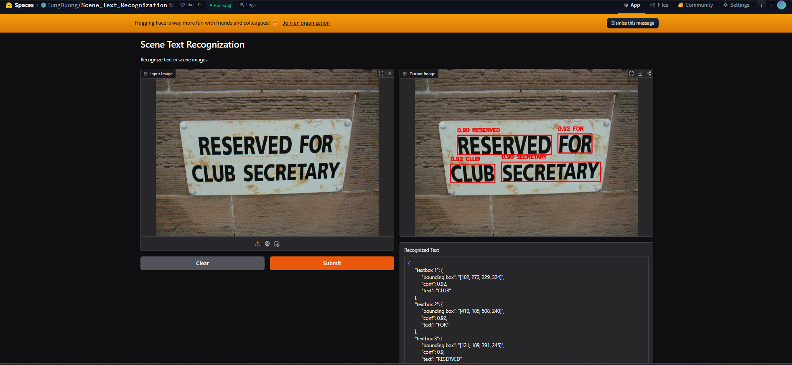

# Scene Text Recognition

## Overview
This project implements a two-stage scene text recognition pipeline. First, the `yolov11` model detects text regions; then, the `CRNN` model reads the text. It efficiently handles challenges like diverse fonts, complex backgrounds, and various orientations.

Download the dataset [here](https://drive.google.com/file/d/1kUy2tuH-kKBlFCNA0a9sqD2TG4uyvBnV/view).

## Pipeline


## Results


## Deploy on Hugging Face
Try the live demo on Hugging Face Spaces: [Scene Text Recognition](https://huggingface.co/spaces/TungDuong/Scene_Text_Recognization)



## How to Run
1. Navigate to the project directory:
   ```bash
   cd path/to/Scene_Text_Recognization
2. Run the prediction script:
    ```bash
    python src/predict.py --image_path=path/to/your/image --save_path=path/to/saved/directory
# Reporoduce
## Dataset Structure

    Dataset
    ├── apanar_06.08.2002
    │   └── image.jpg
    │   └── ...
    │── lfsosa_12.08.2002
    │   └── image.jpg
    │   └── ...
    ├── ryoungt_03.09.2002
    │   └── image.jpg
    │   └── ...
    ├── ryoungt_05.08.2002
    │   └── image.jpg
    │   └── ...
    ├── locations.xml
    ├── segmentation.xml
    ├── words.xml

## Preparing the Datasets
- For YOLO dataset
    ```bash
    python src/Text_Localization/prepare_dataset.py
- For CRNN dataset
    ```bash
    python src/Text_Recognization/prepare_dataset.py